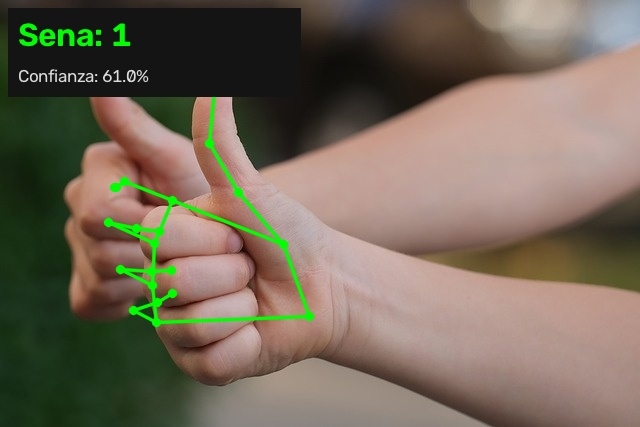

# SignAI — Reconocimiento de dígitos 0–5 con visión por computadora

Prototipo de reconocimiento de **señas estáticas de la mano (dígitos 0 a 5) en
tiempo real**. La cámara captura la mano, **MediaPipe** extrae 21 puntos clave
(landmarks), se forma un vector de **63 coordenadas (x, y, z)** y un
**Random Forest** clasifica la seña, mostrando el resultado en pantalla con
confianza y esqueleto dibujado.

| | |
|---|---|
| **Rama de IA** | Visión por Computadora |
| **Equipo** | Equipo 4 — materia Fundamentos de IA |
| **Modelo** | Random Forest (< 2 MB) + MediaPipe Hand Landmarker |
| **Plataforma** | Windows, laptop sin GPU (todo corre en CPU) |



---

## 1. Cómo funciona

```
Cámara / video / imagen / CSV
        │
        ▼
MediaPipe HandLandmarker  ──►  21 landmarks de la mano
        │
        ▼
Normalización  ──►  vector de 63 valores
(origen en la muñeca,             (x0,y0,z0 ... x20,y20,z20)
 escala por tamaño de mano)
        │
        ▼
Random Forest (scikit-learn) ──►  dígito 0–5 + confianza
        │
        ▼
Pantalla: seña identificada, FPS y esqueleto de la mano
```

La normalización hace que el sistema reconozca la seña **igual esté la mano
cerca o lejos, en cualquier posición de la imagen y con cualquier tamaño**.

## 2. Requisitos

- Windows 10/11 (probado también funciona en Linux/macOS)
- Python **3.10 o superior** (probado con Python 3.14.0)
- Cámara web **solo** para la recolección de datos y el modo tiempo real
  (sin cámara se puede entrenar y probar con los datos incluidos)
- ~1 GB de espacio para el entorno y el `.exe`

## 3. Instalación

```powershell
git clone https://github.com/mEzAcRiS/SignAI.git
cd SignAI

python -m venv .venv
.\.venv\Scripts\python.exe -m pip install -r requirements.txt
```

Si falta el modelo de landmarks se descarga con:

```powershell
.\.venv\Scripts\python.exe scripts\download_model.py
```

## 4. Uso

### 4.1 Entrenar (funciona sin cámara)

```powershell
.\.venv\Scripts\python.exe src\train.py
```

Si aún no existe `data/hand_landmarks.csv` (datos reales), el programa avisa y
entrena automáticamente con los **datos de prueba** incluidos en
`data/samples/hand_landmarks_sample.csv`.

### 4.2 Tiempo real con cámara

```powershell
.\.venv\Scripts\python.exe src\app.py
```

Teclas: **ESC** salir · **P** pausa · **S** guardar captura.

### 4.3 Sin cámara (modos de demostración)

```powershell
# Sobre una imagen con la mano
.\.venv\Scripts\python.exe src\app.py --demo-image data\samples\hand_test.jpg

# Sobre un video grabado
.\.venv\Scripts\python.exe src\app.py --demo video.mp4

# Sobre un CSV de características (solo consola)
.\.venv\Scripts\python.exe src\app.py --csv data\samples\hand_landmarks_sample.csv

# Sin ventanas (solo consola, útil para pruebas remotas)
.\.venv\Scripts\python.exe src\app.py --demo-image data\samples\hand_test.jpg --no-gui
```

### 4.4 Recolección de datos con cámara (cada integrante)

```powershell
.\.venv\Scripts\python.exe src\collect_data.py --person Alan --per-class 150
```

Teclas: **0–5** elegir dígito · **ESPACIO** capturar · **A** captura automática
· **ESC** guardar y salir. Cada integrante genera `data/collected/<nombre>.csv`
y al final se unen todos:

```powershell
.\.venv\Scripts\python.exe src\collect_data.py --merge
```

### 4.5 Ejecutable sin Python (`.exe`)

```powershell
scripts\build_exe.bat
dist\SignAI\SignAI.exe --demo-image data\samples\hand_test.jpg
```

## 5. Estructura del proyecto

```
SignAI/
├── README.md                  # este archivo
├── requirements.txt           # dependencias con versión congelada
├── pytest.ini                 # configuración de las pruebas
├── src/
│   ├── config.py              # rutas, clases 0–5 e hiperparámetros
│   ├── hand_detector.py       # MediaPipe → 21 landmarks → 63 valores
│   ├── dataset.py             # lectura/validación/merge de CSV
│   ├── collect_data.py        # recolección con cámara
│   ├── train.py               # RF + SVM + MLP, validación cruzada
│   ├── predict.py             # predicción por imagen/video/CSV
│   └── app.py                 # aplicación en tiempo real
├── scripts/
│   ├── download_model.py      # descarga el modelo de landmarks
│   ├── make_sample_data.py    # regenera los datos de prueba
│   └── build_exe.bat          # construye el .exe
├── tests/                     # 36 pruebas automatizadas (pytest)
├── models/                    # hand_landmarker.task + model.joblib
├── data/
│   ├── samples/               # datos de prueba + imagen de prueba
│   └── collected/             # CSV por integrante (se genera)
└── docs/                      # capturas y matriz de confusión
```

## 6. Pruebas (QA)

```powershell
.\.venv\Scripts\python.exe -m pytest
```

Cobertura: normalización de landmarks, validación del dataset, entrenamiento,
predicción, suavizado de la app y modos sin cámara.

## 7. Créditos y licencias de las dependencias

| Componente | Versión | Licencia | Fuente |
|---|---|---|---|
| MediaPipe (Tasks: HandLandmarker) | 1.0.1 | Apache-2.0 | https://developers.google.com/mediapipe |
| Modelo `hand_landmarker.task` | float16/1 | Apache-2.0 | https://storage.googleapis.com/mediapipe-models/hand_landmarker/ |
| scikit-learn | 1.9.1 | BSD-3-Clause | https://scikit-learn.org |
| OpenCV (`opencv-contrib-python`) | 5.0.0.93 | Apache-2.0 | https://opencv.org |
| pandas | 3.0.6 | BSD-3-Clause | https://pandas.pydata.org |
| NumPy | 2.5.3 | BSD-3-Clause | https://numpy.org |
| SciPy | 1.18.1 | BSD-3-Clause | https://scipy.org |
| joblib | 1.6.0 | BSD-3-Clause | https://joblib.readthedocs.io |
| matplotlib | 3.11.2 | PSF-based | https://matplotlib.org |
| PyInstaller | 6.22.3 | GPL-2.0 (con excepción) | https://pyinstaller.org |

**Datos e imágenes**

| Recurso | Origen | Licencia |
|---|---|---|
| `data/samples/hand_landmarks_sample.csv` (900 muestras) | Generado por el equipo con `scripts/make_sample_data.py` (sintético, solo para pruebas) | CC0 – uso libre |
| `data/samples/hand_test.jpg` | Muestra oficial de [mediapipe-samples](https://github.com/google-ai-edge/mediapipe-samples) (androidTest/assets) | Apache-2.0 |
| Dataset real de los dígitos 0–5 | Recolectado por el equipo con `src/collect_data.py` | CC0 – uso libre |

## 8. Declaración de uso de IA generativa

De acuerdo con el enunciado de la materia, se declara:

- **Generado con asistencia de IA:** andamiaje inicial de los módulos
  (`src/`, `scripts/`, `tests/`), documentación y esta bitácora.
- **Modificado por el equipo:** estructura del proyecto, selección de
  hiperparámetros, normalización de características, diseño de la interfaz,
  pruebas y validación de resultados.
- **Verificación:** todo el código pasa la suite `pytest` y se probó de forma
  manual (imagen, CSV y `.exe`); los prompts utilizados se registran en la
  bitácora de la Entrega 4.

*(Esta sección se afinará con el detalle exacto por archivo en la Entrega 1.)*

## 9. Referencias

- MediaPipe Tasks – Hand Landmarker:
  https://developers.google.com/mediapipe/solutions/vision/hand_landmarker
- Scikit-learn – Random Forest:
  https://scikit-learn.org/stable/modules/ensemble.html#forests-of-randomized-trees
